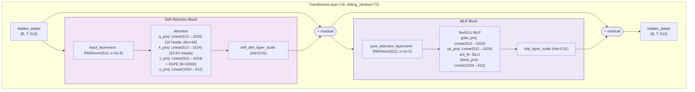
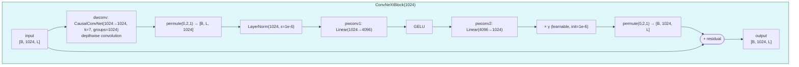
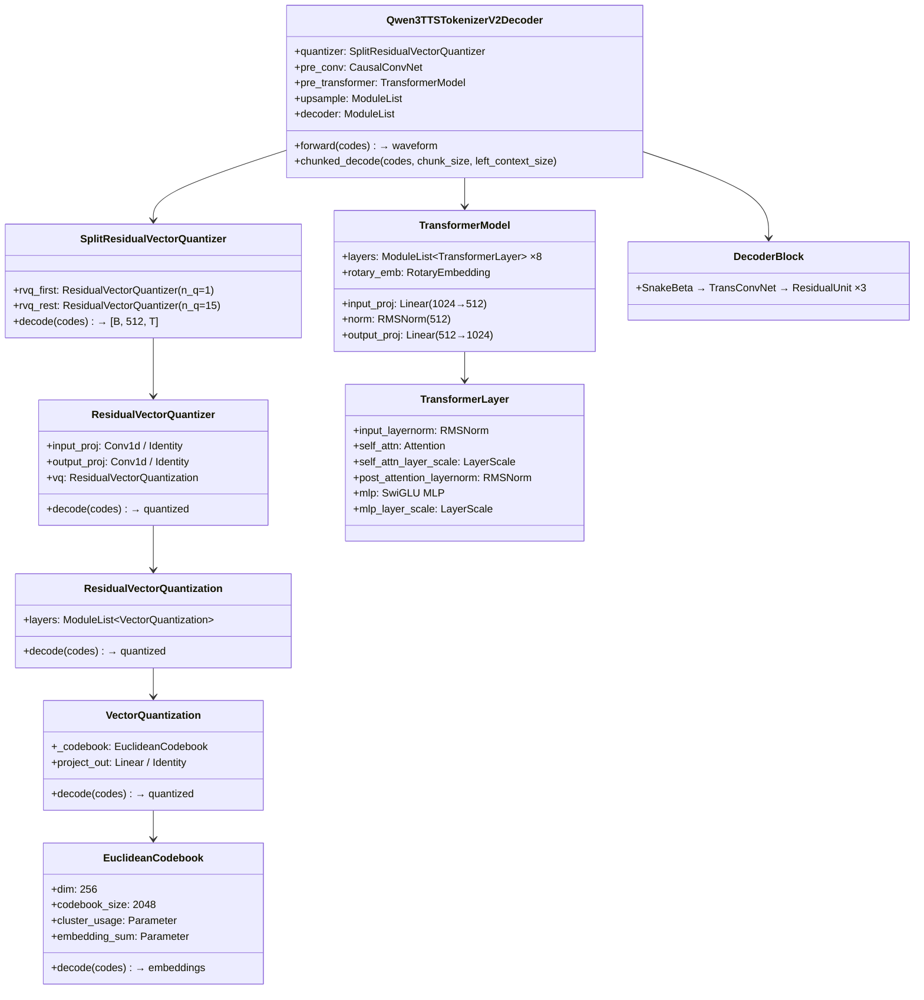

# Qwen3TTSTokenizerV2Decoder Architecture

> Config: [Qwen3-TTS-12Hz-0.6B-Base/speech_tokenizer/config.json](https://huggingface.co/Qwen/Qwen3-TTS-12Hz-0.6B-Base/raw/main/speech_tokenizer/config.json)

## Overall Forward Flow

```mermaid
flowchart TD
    Input["codes<br/>[B, 16, T]"]

    subgraph Quantizer["SplitResidualVectorQuantizer.decode"]
        Q1["rvq_first (semantic, n_q=1)<br/>Conv1d(512→256) → Codebook(256, 2048) → Conv1d(256→512)"]
        Q2["rvq_rest (acoustic, n_q=15)<br/>Conv1d(512→256) → Codebook(256, 2048)×15 → Conv1d(256→512)"]
        QSum(["rvq_first + rvq_rest"])
        Q1 --> QSum
        Q2 --> QSum
    end

    PreConv["pre_conv: CausalConvNet(512→1024, k=3)"]
    Transpose1["transpose(1,2)<br/>[B, 1024, T] → [B, T, 1024]"]

    subgraph Transformer["pre_transformer: TransformerModel"]
        TIn["input_proj: Linear(1024→512)"]
        TLayers["TransformerLayer × 8<br/>(sliding_window=72, RoPE)"]
        TNorm["norm: RMSNorm(512)"]
        TOut["output_proj: Linear(512→1024)"]
        TIn --> TLayers --> TNorm --> TOut
    end

    Permute["permute(0,2,1)<br/>[B, T, 1024] → [B, 1024, T]"]

    subgraph Upsample["upsample (upsampling_ratios=[2, 2])"]
        U0["TransConvNet(1024→1024, k=2, s=2) + ConvNeXtBlock(1024)<br/>×2 → [B, 1024, T×2]"]
        U1["TransConvNet(1024→1024, k=2, s=2) + ConvNeXtBlock(1024)<br/>×2 → [B, 1024, T×4]"]
        U0 --> U1
    end

    subgraph Decoder["decoder (upsample_rates=[8, 5, 4, 3])"]
        DPre["CausalConvNet(1024→1536, k=7)"]
        D0["DecoderBlock[0]: ×8<br/>1536→768 → [B, 768, T×32]"]
        D1["DecoderBlock[1]: ×5<br/>768→384 → [B, 384, T×160]"]
        D2["DecoderBlock[2]: ×4<br/>384→192 → [B, 192, T×640]"]
        D3["DecoderBlock[3]: ×3<br/>192→96 → [B, 96, T×1920]"]
        DSnake["SnakeBeta(96)"]
        DOut["CausalConvNet(96→1, k=7)"]
        DPre --> D0 --> D1 --> D2 --> D3 --> DSnake --> DOut
    end

    Clamp["clamp(-1, 1)"]
    Output["waveform<br/>[B, 1, T×1920]"]

    Input --> Quantizer
    QSum --> PreConv --> Transpose1 --> Transformer
    TOut --> Permute --> Upsample
    U1 --> Decoder
    DOut --> Clamp --> Output

    style Input fill:#e3f2fd,stroke:#1565c0
    style Output fill:#e8f5e9,stroke:#2e7d32
    style Quantizer fill:#fff3e0,stroke:#e65100
    style Transformer fill:#f3e5f5,stroke:#6a1b9a
    style Upsample fill:#e0f7fa,stroke:#00695c
    style Decoder fill:#fce4ec,stroke:#b71c1c
```



## TransformerLayer Detail



## DecoderBlock Detail

```mermaid
flowchart TD
    subgraph DBlock["DecoderBlock[i]"]
        DIn["input<br/>[B, in_dim, L]"]
        Snake1["SnakeBeta(in_dim)"]
        TConv["CausalTransConvNet(in_dim→out_dim, k=2×rate, stride=rate)"]

        subgraph RU1["ResidualUnit (dilation=1)"]
            R1S1["SnakeBeta(out_dim)"]
            R1C1["CausalConvNet(out_dim→out_dim, k=7, d=1)"]
            R1S2["SnakeBeta(out_dim)"]
            R1C2["CausalConvNet(out_dim→out_dim, k=1)"]
            R1Res(["+ residual"])
            R1S1 --> R1C1 --> R1S2 --> R1C2 --> R1Res
        end

        subgraph RU2["ResidualUnit (dilation=3)"]
            R2S1["SnakeBeta(out_dim)"]
            R2C1["CausalConvNet(out_dim→out_dim, k=7, d=3)"]
            R2S2["SnakeBeta(out_dim)"]
            R2C2["CausalConvNet(out_dim→out_dim, k=1)"]
            R2Res(["+ residual"])
            R2S1 --> R2C1 --> R2S2 --> R2C2 --> R2Res
        end

        subgraph RU3["ResidualUnit (dilation=9)"]
            R3S1["SnakeBeta(out_dim)"]
            R3C1["CausalConvNet(out_dim→out_dim, k=7, d=9)"]
            R3S2["SnakeBeta(out_dim)"]
            R3C2["CausalConvNet(out_dim→out_dim, k=1)"]
            R3Res(["+ residual"])
            R3S1 --> R3C1 --> R3S2 --> R3C2 --> R3Res
        end

        DOut["output<br/>[B, out_dim, L×rate]"]

        DIn --> Snake1 --> TConv --> RU1
        R1Res --> RU2
        R2Res --> RU3
        R3Res --> DOut
    end

    style DBlock fill:#fce4ec,stroke:#b71c1c
    style RU1 fill:#ffebee,stroke:#c62828
    style RU2 fill:#ffebee,stroke:#c62828
    style RU3 fill:#ffebee,stroke:#c62828
```



## DecoderBlock Parameters

| Block | upsample_rate | in_dim | out_dim | TransConv kernel | Output size |
|-------|:---:|:---:|:---:|:---:|:---:|
| DecoderBlock[0] | 8 | 1536 | 768 | 16 | [B, 768, T×32] |
| DecoderBlock[1] | 5 | 768 | 384 | 10 | [B, 384, T×160] |
| DecoderBlock[2] | 4 | 384 | 192 | 8 | [B, 192, T×640] |
| DecoderBlock[3] | 3 | 192 | 96 | 6 | [B, 96, T×1920] |

> `in_dim = decoder_dim // 2^i`, `out_dim = decoder_dim // 2^(i+1)`, `kernel = 2 × rate`

## ConvNeXtBlock Detail



## Upsampling Calculation

```
Token rate: 12.5 Hz (12.5 tokens per second)

upsampling_ratios: 2 × 2 = 4×
upsample_rates:    8 × 5 × 4 × 3 = 480×
────────────────────────────────────────
Total: 4 × 480 = 1,920×

Output sample rate: 12.5 Hz × 1,920 = 24,000 Hz (24 kHz)
```

## SnakeBeta Activation Function

```
SnakeBeta(x) = x + (1/β) × sin²(αx)

  α, β: per-channel learnable parameters (exponentiated to ensure positivity)
  I/O:  [B, C, T] → [B, C, T]
```

## Class Hierarchy



## Config Parameters

### decoder_config

| Parameter | Value | Description |
|-----------|-------|-------------|
| `codebook_size` | 2048 | Number of codebook entries |
| `codebook_dim` | 512 | Codebook dimension |
| `hidden_size` | 512 | Transformer hidden dimension |
| `latent_dim` | 1024 | Latent representation dimension |
| `num_hidden_layers` | 8 | Number of Transformer layers |
| `num_attention_heads` | 16 | Number of attention heads |
| `num_key_value_heads` | 16 | Number of KV heads |
| `head_dim` | 64 | Dimension per head |
| `intermediate_size` | 1024 | MLP intermediate dimension |
| `hidden_act` | silu | MLP activation function |
| `sliding_window` | 72 | Sliding window size |
| `max_position_embeddings` | 8000 | Maximum position embedding length |
| `rope_theta` | 10000 | RoPE base period |
| `layer_scale_initial_scale` | 0.01 | Initial value for LayerScale |
| `rms_norm_eps` | 1e-5 | ε for RMSNorm |
| `num_quantizers` | 16 | Number of quantizers |
| `decoder_dim` | 1536 | Initial decoder channel count |
| `upsample_rates` | [8, 5, 4, 3] | Upsample rates for waveform generation stages |
| `upsampling_ratios` | [2, 2] | Upsample ratios after Transformer |
